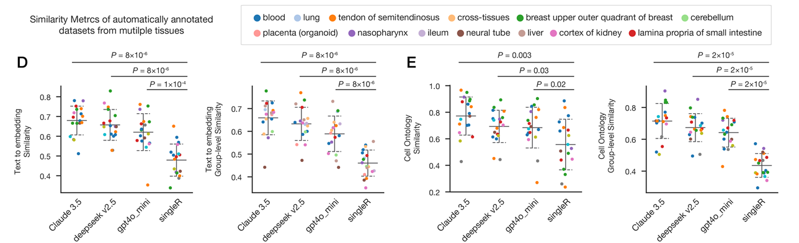

# scExtract: Automatic annotation and integration of single-cell RNA-seq datasets from the literature

scExtract is a tool for automating the extraction, processing, and annotation of single-cell data from literature. The tool is designed to use LLMs to extract relevant information from scientific articles and process the data.

The input of the program are an anndata object and a PDF/txt file containing the article from which the single-cell data is to be extracted. 

## Usage

- Step1: Clone repo from github and install locally
```
git clone https://github.com/yxwucq/scExtract
cd scExtract
pip install -e .
```

- Step2: run `scExtract init` to generate config file

```
[API]
API_KEY = YOUR_API_KEY
API_BASE_URL = https://api.deepseek.com/v1
# Supported API styles: openai, claude
TYPE = openai
MODEL = deepseek-chat
TOOL_MODEL = deepseek-chat
```

If you want to benchmark auto-annotation using similarity of annotated-text or later integrate your datasets, you need convert annotation to embedding using LLM, by setting `CONVERT_EMBEDDING = true`.

If you using GPTs for text extraction, you can set `API_STYLES = same` to use same setting. But there are no official text-to-embedding model in Claudes, you can set `API_STYLES = azure|openai` and according api key and endpoint to use Openai t2e model while using Claudes for text extraction.

- Finally, directly excute by typing `scExtract`:

```
scExtract -h   
```

### Annotate

Using `auto_extract` subcommand. Make sure to add `Batch` key to raw_adata.obs for possible batch correction within dataset. Sample datasets can be found at https://zenodo.org/records/13827072.

```
scExtract auto_extract \
    -i ADATA_PATH \
    -p PDF_PATH \
    -d OUTPUT_DIR \
    -o OUTPUT_NAME
```

### Integration

For integration with standard scExtract pipeline, first install [cellhint_prior](https://github.com/yxwucq/cellhint_prior) and [scanorama_prior](https://github.com/yxwucq/scanorama_prior). Then using `integrate` subcommand.

```
scExtract integrate \
    -f *.h5ad \
    -m scExtract \
    --embedding_dict_path embedding_dict.pkl
    --output_path integrate_output.h5ad
```

For large dataset computed on HPC without internet access, you can do two-step integration:

First (without internet access):

```
scExtract integrate \
    -f *.h5ad \
    -m cellhint_prior \
    --embedding_dict_path embedding_dict.pkl
    --output_path integrate_output_tmp.h5ad
```

Then (with internet access):

```
scExtract extract_celltype_embedding \
    --file_list integrate_output_tmp.h5ad \
    --cell_type_column cell_type \
    --output_embedding_pkl harmonized_embedding_dict.pkl
```

Finally (without internet access):

```
scExtract integrate \
    -f integrate_output_tmp.h5ad \
    -m scanorama_prior \
    --embedding_dict_path harmonized_embedding_dict.pkl
    --output_path integrate_output.h5ad

rm integrate_output_tmp.h5ad
```

### Benchmark

For benchmark, using `benchmark` subcommand:
```
scExtract benchmark \
    -i INPUT_ADATA \
    -o OUTPUT_ADATA \
    -r METRICS_FILE \
    --true_group_key TRUE_KEY \
    --predict_group_key KEY1,KEY2,... \
    --similarity_key SIMI_KEY1,SIMI_KEY2,...
```

## Other methods
scExtract supports external annotation methods using `add_singler_annotation`, `add_sctype_annotation`, `add_celltypist_annotation`

## Example



### sample
Muto, Y., Wilson, P.C., Ledru, N. et al. Single cell transcriptional and chromatin accessibility profiling redefine cellular heterogeneity in the adult human kidney. Nat Commun 12, 2190 (2021). https://doi.org/10.1038/s41467-021-22368-w

`Cell_type` is author-defined cell type, `scExtract` is cell type extracted from scExtract, `no_context_anno` is cell type extracted without context information, `singler` is cell type from singleR. `Tissue`, `Certainty` are from scExtract.


## Citation
If you use scExtract in your research, please cite:

> **Wu, Y., Tang, F.** scExtract: leveraging large language models for fully automated single-cell RNA-seq data annotation and prior-informed multi-dataset integration. *Genome Biology* **26**, 174 (2025). https://doi.org/10.1186/s13059-025-03639-x