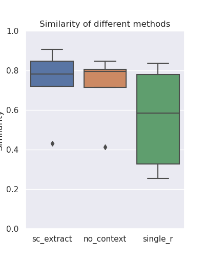

# scExtract: Automatic annotation and integration of single-cell RNA-seq datasets from the literature

scExtract is a tool for automating the extraction, processing, and annotation of single-cell data from literature. The tool is designed to use LLMs to extract relevant information from scientific articles and process the data.

## Usage
The input of the program are an anndata object and a PDF/txt file containing the article from which the single-cell data is to be extracted. 

First copy `auto_extract/config_sample.py` to `auto_extract/config.py`, then fill your api provider(Claude3 and OpenAI models are both supported) in `auto_extract/config.py`:

```
class Config:
    API_KEY = 'YOUR_API_KEY'
    API_BASE_URL = "YOUR_API_BASE_URL" # for third party openai api
    TYPE = "openai" # claude or openai
    MODEL = "claude-3-sonnet-20240229" # model processing the article
    TOOL_MODEL = "claude-3-opus-20240229" # model for short messages
```

If you want to benchmark auto-annotation using similarity of annotated-text or later integrate your datasets, you need convert annotation to embedding using LLM, by setting `CONVERT_EMBEDDING = True` in `config.py`:

```
class Config:
    ...
    CONVERT_EMBEDDING = True
    EMBEDDING_MODEL = 'text-embedding-3-large'
    API_STYLES = '' # values from ['azure', 'same', 'openai']
    EMBEDDING_API_KEY = ''
    EMBEDDING_ENDPOINT = ''
```

If you using GPTs for text extraction, you can set `API_STYLES = same` to use same setting. But there are no official text-to-embedding model in Claudes, you can set `API_STYLES = azure|openai` and according api key and endpoint to use Openai t2e model while using Claudes for text extraction.

Then directly excute through `python main.py `

### Annotate

Using `auto_extract` subcommand.

```
python main.py auto_extract \
    -i ADATA_PATH \
    -p PDF_PATH \
    -d OUTPUT_DIR \
    -o OUTPUT_NAME
```

The extraction follows these steps, the processing decisions/parameters are all article-based.
1. Filter: Including Min_genes, Min_cells, Mitochondria_counts_percentage, etc.
2. Preprocess: Including Normalization, Log1p_transform, Highly_variable_genes_selection, etc.
3. Unsupervised clustering: Leiden clustering or Louvain clustering to similar groups as defined in the text
4. Marker gene identification: Find marker genes based on differential expression
5. Annotation: Cell type annotation
6. Reannotating clusters(Optional): Query the low-confidence annotations associated gene expression and reannotate them

For detailed configuration, refer to `config.py`.

### Benchmark

For a whole process, including extract annotation, add other method, compare with ground truth for benchmarking, you can directly run
`python pipelines.py sample{i}` in the following folder structure:

```
.
├── processed_data
│   └── sample{i}_true.h5ad # Contains `cell_type` col in obs for benchmarking
└── raw_data
    ├── sample{i}.pdf
    └── sample{i}_raw.h5ad # Contains `Batch` col in obs for possible batch correction
```

### Integration

Using `integrate` subcommand.

```
python main.py integrate \
    -f FILE_LIST \
    -m scExtract Method to use for integration. Support scExtract and cellhint. \
    --prior_method llm Method to use for creating the prior similarity matrix. Support ontology, llm and local.
```

For large dataset computed on HPC without internet, you can first generate text embedding by individual dataset using `python integration/extract_celltype_embedding.py`. Then integrate using local provided dict object:

```
python main.py integrate \
    -f FILE_LIST \
    -m scExtract Method to use for integration. Support scExtract and cellhint. \
    --prior_method local \
    --embedding_dict_path EMBEDDING_DICT_PATH Path to the cell type embedding dictionary.
```

## Example



### sample
Muto, Y., Wilson, P.C., Ledru, N. et al. Single cell transcriptional and chromatin accessibility profiling redefine cellular heterogeneity in the adult human kidney. Nat Commun 12, 2190 (2021). https://doi.org/10.1038/s41467-021-22368-w

`Cell_type` is author-defined cell type, `scExtract` is cell type extracted from scExtract, `no_context_anno` is cell type extracted without context information, `singler` is cell type from singleR. `Tissue`, `Certainty` are from scExtract.


## Other methods
### singleR
see `python main.py add_singler_annotation -h`
```
usage: main.py add_singler_annotation [-h] --adata_path ADATA_PATH [--output_path OUTPUT_PATH] [--ref_data REF_DATA] [--ref_features REF_FEATURES]
                                      [--ref_labels REF_LABELS] [--cache_dir CACHE_DIR]

options:
  -h, --help            show this help message and exit
  --adata_path ADATA_PATH, -i ADATA_PATH
                        Path to the processed data in AnnData format.
  --output_path OUTPUT_PATH, -o OUTPUT_PATH
                        Path to save the output file. If not specified, the input file will be overwritten.
  --ref_data REF_DATA, -d REF_DATA
                        Reference data to use for annotation.
  --ref_features REF_FEATURES, -f REF_FEATURES
                        Reference features to use for annotation.
  --ref_labels REF_LABELS, -l REF_LABELS
                        Reference labels to use for annotation.
  --cache_dir CACHE_DIR, -c CACHE_DIR
                        Directory to save the cache files.
```

### LLM without article context
In `python main.py auto_extract`, add `--benchmark_no_context_key`
```
--benchmark_no_context_key BENCHMARK_NO_CONTEXT_KEY, -b BENCHMARK_NO_CONTEXT_KEY
                        If specified, Directly get annotation from marker genes without article context for benchmarking, the result will be saved in
                        adata.obs[benchmark_no_context_key].
```