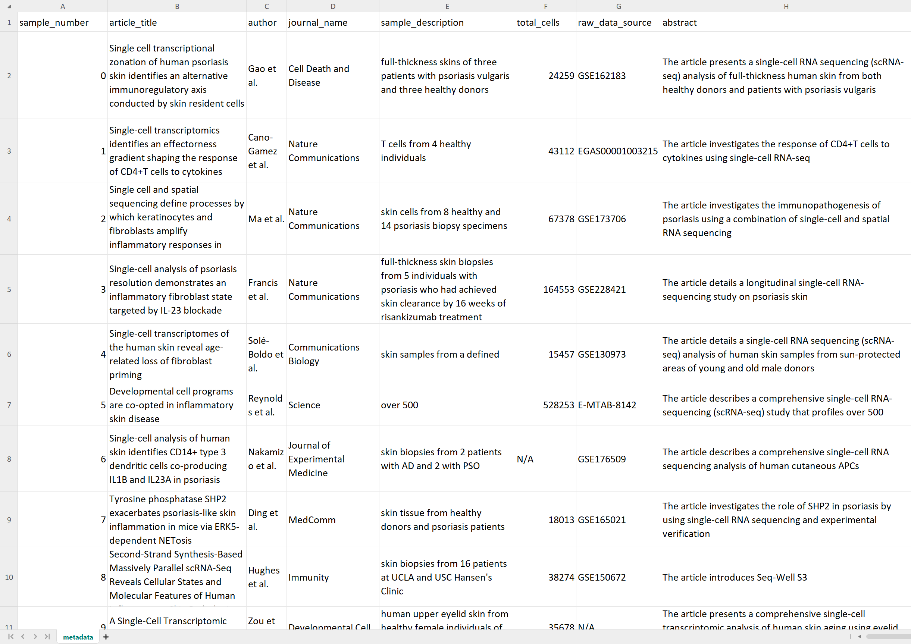

========================================================================================================
Tutorial: Using scExtract to generate single-cell skin atlas from published data
========================================================================================================

In this tutorial, we will demonstrate how to use scExtract to generate a single-cell skin atlas from published data.

scExtract setup and configuration
----------------------------------

First, we need to install scExtract and configure the API key as described in the :ref:`installation` and :ref:`usage` sections.

Metadata extraction
-------------------

Then, we will find some published article that contains single-cell RNA-seq data related to our topic of interest. You can download the PDF file and save it in the `pdfs` folder.

Next, we will run the following command to extract the metadata from the PDF file, add :code:`-s` create project structure:

.. code-block:: bash

    scExtract get_metadata -i pdfs/*.pdf -o metadata.csv -s

After that, we will get the metadata in the :code:`metadata.csv` file, which contains information such as authors, 
title, abstract, cell count per dataset, dataset location, and other details. Meanwhile, directories named after the 
:code:`sample_id` will be created in the current working directory to store subsequent data processing results.

Raw data download and processing
--------------------------------

Next, we need to manually download each dataset. We can exclude datasets that are difficult to access or require mapping, and it's recommended to focus on GSE datasets only. If you want to avoid the manual data preparation process, you can check scBaseCount (https://github.com/ArcInstitute/arc-virtual-cell-atlas) for formatted datasets. This package uses LLM agents to automatically format single-cell RNA datasets, which is like an upstream version of scExtract.

Using :code:`sample0` as an example, after downloading, place it in the :code:`sample0/raw_data directory`. Then use :code:`sc.read_text()` directly to read the dataset.

It's important to note that we need to add a :code:`Batch` column to :code:`adata.obs` for subsequent batch effect correction. It's also recommended to add a :code:`Disease` column 
for cell type annotation across different diseases. To ensure accuracy, this step requires manual input, but we have prepared comprehensive notebooks to help you complete this step, 
please refer to :doc:`notebooks`.

.. code-block:: python

    data.obs['Batch'] = data.obs.index.str.split('_').str[0]
    data.obs['Disease'] = data.obs['Batch'].str[:-1]

Then store it in the :code:`raw_data/sample0_raw.h5ad` file.

Integration
-----------

One-step integration
~~~~~~~~~~~~~~~~~~~~~~~

Next, we can run the :code:`auto_integrate.smk` script in :code:`scExtract/Snakemake` to batch process automatic datasets. 
Remember to install prior-aware integration optional dependencies as described in the :ref:`installation` section

First, place the script and config file in the project root directory, then rename :code:`config_sample.yaml` to :code:`config.yaml`, 
and modify project directory and other information in the config file:

.. code-block:: yaml

    project_dir: /home/wu/projects/scExtract # project directory
    init_config_ini: config.ini
    output_suffix: claude3 # custom suffix

    debug: False
    applied_files: all

    # Step 1: Auto extract
    config_pkl: config.pkl
    log_file: auto_extract.log

    # Step 2: Add embedding
    AddEmbedding.user_dataset: # you can add your own dataset here. Note that the dataset should also contain `Batch` and `Disease` columns
                               # and the cell type annotation should be specified `cell_type` column
    
    # Step 3: Integration
    method: scExtract

Finally, run the following command:

.. code-block:: bash

    snakemake -s auto_integrate.smk

By default, individual datasets will be downsampled in a hierarchical and desenty-based manner, and then integrated. If you are confident in memory usage, 
you can remove the :code:`--downsample` option in the :code:`Integrate` rule.

If you don't want to bother with prior-aware integration, you can set the :code:`method` to :code:`cellhint` to use the original CellHint method.

Step-wise integration
~~~~~~~~~~~~~~~~~~~~~~~~~

* Step 1: Auto extract

If you want to integrate datasets on High-Performance Computing (HPC) clusters, you can use the step-wise integration method.
Use rule :code:`AddEmbedding` and :code:`Integrate_Input` instead of the :code:`Integrate` rule in the :code:`auto_integrate.smk` script.
This will process each dataset and generate the merged embedding dictionary in the output directory.

.. code-block:: bash

    ls integrated_input_claude3_5/

    # Output
    claude3_5_embedding_dict.pkl
    sample{i}_claude3_5_extracted.h5ad

* Step 2: Integration

After generating the merged embedding dictionary, we upload the dictionary and the extracted data to the HPC cluster.
Then run the following command:

.. code-block:: bash

    scExtract integrate -f *.h5ad -m cellhint_prior \
        --embedding_dict_path claude3_5_embedding_dict.pkl --output_path integrate_output_tmp.h5ad

This step will correct mis-annotations, so we need to generate new annotations embeddings with internet again using:

.. code-block:: bash

    scExtract extract_celltype_embedding -f integrate_output_tmp.h5ad --cell_type_column cell_type \
        --output_embedding_pkl harmonized_embedding_dict.pkl

Finally, we can run the second turn integration to generate the final integrated dataset:

.. code-block:: bash

    scExtract integrate -f integrate_output_tmp.h5ad -m scanorama_prior \
        --embedding_dict_path harmonized_embedding_dict.pkl --output_path integrate_output.h5ad
